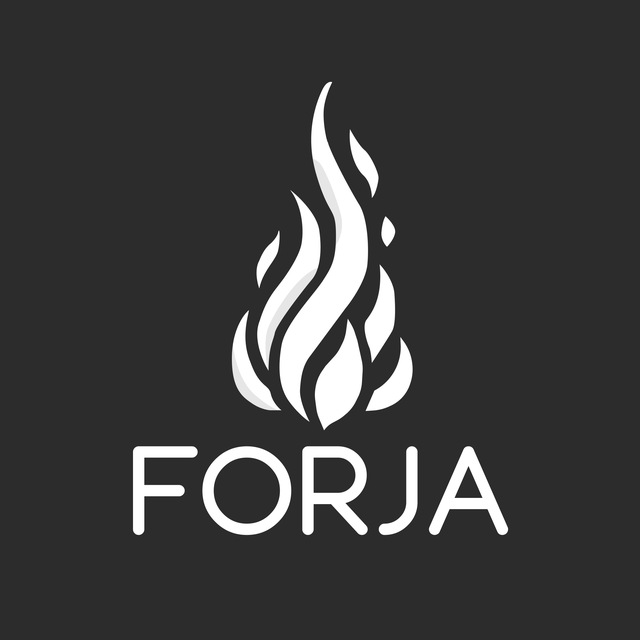

# Forja Platform



Forja is a diploma project platform inspired by battle.net. It is designed to be a centralized hub for gamers, featuring user authentication, file storage, and caching, along with a modern, responsive frontend and a robust backend powered by the .NET platform.

---

## Table of Contents

- [Overview](#overview)
- [Features](#features)
- [Technology Stack](#technology-stack)
- [Project Structure](#project-structure)
- [Getting Started](#getting-started)
  - [Prerequisites](#prerequisites)
  - [Installation](#installation)
- [Development](#development)
- [Deployment](#deployment)
- [Contributing](#contributing)
- [License](#license)
- [Acknowledgements](#acknowledgements)

---

## Overview

Forja Platform is a modern web application built to serve as an analog to battle.net, providing a rich user experience for gamers. The platform features:
- A **.NET backend** to handle business logic, data storage, and external integrations.
- A **React frontend** for a dynamic and responsive user interface.
- A ***.Net Aspire** to orchestrate services.
- Integration with third-party services such as **Keycloak** for authentication, **MinIO** for file storage, **PostgreSQL** for the database, **Redis** for caching.
- A clean and scalable codebase suitable for further expansion and additional features like AI integration in the future.

---

## Features

- **User Authentication & Authorization:** Managed via Keycloak.
- **Responsive UI:** Built using React with a modular component structure.
- **Secure File Storage:** Leveraging MinIO for S3-compatible storage.
- **Robust Backend:** Developed with .NET/C# to handle business logic and API endpoints.
- **Efficient Caching:** Redis integration for improved performance.
- **Database:** PostgreSQL for reliable and scalable data storage.
- **Cross-platform desktop launcher application:** Built on Avalonia framework.
- **Future AI Integration:** Potential integration with Llama for AI-powered features.

---

## Technology Stack

- **Backend:** .NET 9 (C#)
- **Frontend:** React
- **Authentication:** Keycloak
- **Storage:** MinIO
- **Database:** PostgreSQL
- **Caching:** Redis
- **Orchestration:** .Net Aspire
- **Cross-platform desktop launcher application:** Avalonia

---

## Project Structure

```
    forja-platform/
    ├── src                           # Source projects
    │   ├── Api/                      # Web Api projects
    │   │   └── Forja.Api/             # PAPI controllers and middleware (CORS, etc.)
    │   ├── Aspire/                   # .Net Aspire orchestration projects
    │   │   ├── Forja.AppHost/         # Projects orchestration
    │   │   └── Forja.ServiceDefaults/ # General dependencies
    │   ├── Launcher/                # .NET layer libraries
    │   │   └── Forja.Launcher/       # Cross-platform game launcher
    │   ├── Libraries/                # .NET layer libraries
    │   │   ├── Forja.Application/     # Business logic, services, and use case implementations
    │   │   ├── Forja.Domain/          # Domain models, entities, and interfaces
    │   │   └── Forja.Infrastructure/  # Data access and integration with external services
    │   └── Web/                      # Web applications
    │       └── forja-next/          # React web application
    │           ├── public/           # Static assets
    │           ├── src/              # Source code: components, pages, services, store, utils
    │           └── package.json       # Node dependencies and scripts
    ├── assets/                       # Project assets
    ├── docs/                         # Project documentation
    │   ├── architecture.md            # Architectural decisions and diagrams
    │   ├── design.md                  # UI/UX design documentation
    │   └── setup.md                   # Setup instructions
    ├── ForjaPlatform.sln             # Visual Studio solution file
    ├── LICENSE                        # Project license
    └── README.md                      # Project overview and quick start guide
```

---

## Getting Started

### Prerequisites

Before you begin, ensure you have installed:
- [Docker](https://www.docker.com/get-started)
- [.NET 9 SDK](https://dotnet.microsoft.com/download)
- [Node.js and npm](https://nodejs.org/) (or [Yarn](https://yarnpkg.com/)) for the React frontend

### Installation

1. **Clone the repository:**

```bash
    git clone https://github.com/HryhoriiKyrylchenko/forja-platform.git
    cd forja-platform/src/Web/
    git clone https://github.com/CheDeniss/forja-next
```

2. **Backend Setup:**

- Navigate to the backend folder.
- Restore dependencies and build the project:

```bash
    dotnet restore
    dotnet build
```
3. **Frontend Setup:**

- Navigate to the `frontend/` folder.
- Install the dependencies:

```bash
    npm install
    npm install keycloak-js
    # or if you use Yarn:
    yarn install
```

4. **Environment Variables:**

- Configure your environment variables. You can refer to the [`docs/setup.md`](./docs/setup.md) for detailed instructions.

---

## Development

### Running Locally with .Net Aspire

You can run the project directly from Visual Studio or using the command line:

```bash
    dotnet run --project aspire/Forja.AppHost/Forja.AppHost.csproj
```

## Deployment

For production deployment, consider using your preferred cloud hosting or container orchestration service.

---

## Contributing

Contributions are welcome! Please follow these steps:

1. Fork the repository.
2. Create a new branch: git checkout -b feature/your-feature.
3. Commit your changes: git commit -m 'Add some feature'.
4. Push to the branch: git push origin feature/your-feature.
5. Open a pull request.

For major changes, please open an issue first to discuss what you would like to change.

---

## License

This project is licensed under the [`AGPL-3.0 license`](./LICENSE).

---

## Acknowledgements

Special thanks to the developers, designers, and cybersecurity specialist on the Forja team.
Inspiration drawn from battle.net and similar platforms.
Thanks to the open-source community for providing the tools and libraries that made this project possible.

---

Happy coding!